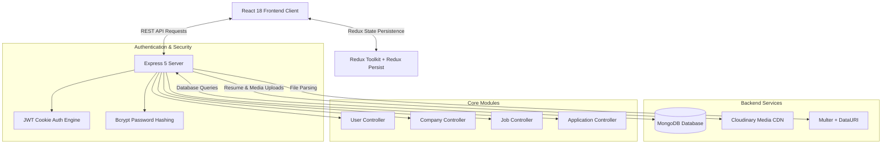

<div align="center">

# 💼 Full-Stack Job Portal & Recruitment Platform

An executive, enterprise-ready Full-Stack Job Portal and Career Management Platform built with **React 19**, **Redux Toolkit**, **Node.js**, **Express**, **MongoDB**, **Cloudinary**, **Radix UI**, and **Tailwind CSS**.

[](https://nodejs.org/)
[](https://react.dev/)
[](https://redux-toolkit.js.org/)
[](https://expressjs.com/)
[](https://www.mongodb.com/)
[](https://cloudinary.com/)
[](LICENSE)

[Explore Features](#-key-features--role-portals) · [System Architecture](#-system-architecture) · [API Specification](#-api-endpoints-reference) · [Quick Start](#-quick-start--local-setup)

</div>

---

## 📌 Table of Contents

- [Executive Summary](#-executive-summary)
- [Key Features & Role Portals](#-key-features--role-portals)
- [System Architecture](#-system-architecture)
- [Tech Stack Breakdown](#-tech-stack-breakdown)
- [Project Directory Layout](#-project-directory-layout)
- [Environment Configuration](#-environment-configuration)
- [Quick Start & Local Setup](#-quick-start--local-setup)
- [API Endpoints Reference](#-api-endpoints-reference)
- [Database Schema Reference](#-database-schema-reference)
- [License](#-license)

---

## 📖 Executive Summary

The **Full-Stack Job Portal & Recruitment Platform** is a complete end-to-end web application that connects job seekers with recruiters and hiring managers. Designed around modern user roles, the platform features resume uploads, interactive job filtering, company profile registries, direct application tracking, and an employer administrative dashboard for candidate evaluation.

---

## ✨ Key Features & Role Portals

### 🧑‍💼 1. Job Seeker Portal
- **Advanced Job Search & Filtering**: Search postings by keyword, role, location, industry, or salary expectations.
- **Featured Job Carousel**: Dynamic interactive job showcase powered by `embla-carousel-react`.
- **Resume & Profile Management**: Upload PDF resumes and profile photos integrated with **Cloudinary** media storage.
- **One-Click Application System**: Apply to active job postings and monitor live application statuses (`Pending`, `Accepted`, `Rejected`).
- **Applied Jobs History**: Comprehensive user dashboard displaying application timelines and target companies.

### 🏢 2. Recruiter & Employer Portal
- **Company Profile Registry**: Register corporate profiles with logos, company websites, descriptions, and location details.
- **Job Posting Management**: Post, update, and manage open job listings with experience requirements, salary ranges, and positions open.
- **Applicant Review Dashboard**: View candidate profiles, inspect uploaded PDF resumes, and update hiring application statuses.

---

## 🏗️ System Architecture



---

## 💻 Tech Stack Breakdown

### **Frontend**
| Technology | Description |
| :--- | :--- |
| **React 19** | Core UI component framework |
| **Redux Toolkit & Redux Persist** | Global state management with browser storage persistence |
| **React Router v7** | Client-side routing engine |
| **Tailwind CSS v4 & Radix UI** | Accessible UI primitives, dialogs, dropdowns, and styling |
| **Framer Motion** | Micro-interactions & animated page transitions |
| **Lucide React & Remix Icons** | Vector iconography |
| **Sonner** | Toast notifications engine |

### **Backend**
| Technology | Description |
| :--- | :--- |
| **Node.js & Express 5** | High-performance backend API runtime |
| **MongoDB & Mongoose 8** | Document database & Object Data Modeling (ODM) |
| **Cloudinary SDK** | Cloud media storage for profile pictures & PDF resumes |
| **Multer & DataURI** | Multipart file upload parsing |
| **JSON Web Tokens (JWT)** | Secure cookie-based session management |
| **Winston** | Logging and error tracking |

---

## 📂 Project Directory Layout

```text
job_portal/
├── backend/
│   ├── controllers/           # Controllers (User, Company, Job, Application)
│   ├── middleware/            # JWT Auth verification & Multer upload middleware
│   ├── models/                # Mongoose Schemas (User, Company, Job, Application)
│   ├── routes/                # Express API routes (/user, /company, /job, /application)
│   ├── utils/                 # MongoDB connection & Cloudinary configuration
│   ├── index.js               # Express application entry point
│   └── package.json           # Backend dependencies
├── frontend/
│   ├── public/                # Static assets
│   ├── src/
│   │   ├── components/        # Admin, Auth, UI, and Shared components
│   │   ├── hooks/             # Custom React data-fetching hooks
│   │   ├── redux/             # Redux Toolkit slices (auth, job, company, application)
│   │   ├── App.jsx            # Routing hierarchy
│   │   └── main.jsx           # Application entry point
│   ├── tailwindconfig.js      # Tailwind CSS configuration
│   └── package.json           # Frontend dependencies
└── README.MD                  # Project documentation
```

---

## ⚙️ Environment Configuration

Create a `.env` file in the `backend/` directory:

```env
# Server & Client Setup
PORT=8000
NODE_ENV=development
FRONTEND_URL=http://localhost:5173

# Database Connection
MONGO_URI=mongodb+srv://<username>:<password>@cluster.mongodb.net/job_portal_db

# Security & Authentication
JWT_SECRET=your_super_secret_jwt_key

# Cloudinary Storage Setup
CLOUDINARY_CLOUD_NAME=your_cloud_name
CLOUDINARY_API_KEY=your_api_key
CLOUDINARY_API_SECRET=your_api_secret
```

---

## 🚀 Quick Start & Local Setup

### 1. Prerequisites
- **Node.js** (v18.0.0 or higher)
- **MongoDB** instance (local or MongoDB Atlas)
- **Cloudinary** account (for file/resume uploads)

### 2. Clone the Repository
```bash
git clone https://github.com/sonam10115/job_portal.git
cd job_portal
```

### 3. Install Dependencies
```bash
# Install backend dependencies
cd backend
npm install

# Install frontend dependencies
cd ../frontend
npm install
```

### 4. Run in Development Mode
```bash
# Terminal 1: Start Backend API Server (Port 8000)
cd backend
npm run dev

# Terminal 2: Start Frontend Dev Server (Port 5173)
cd frontend
npm run dev
```

---

## 📡 API Endpoints Reference

### 👤 User Endpoints (`/api/v1/user`)
| Method | Endpoint | Description | Auth Required |
| :--- | :--- | :--- | :--- |
| `POST` | `/api/v1/user/register` | Register new Job Seeker or Recruiter | No |
| `POST` | `/api/v1/user/login` | Authenticate user & receive JWT cookie | No |
| `GET` | `/api/v1/user/logout` | End user session & clear cookies | Yes |
| `POST` | `/api/v1/user/profile/update` | Update profile info & upload resume PDF | Yes |

### 🏢 Company Endpoints (`/api/v1/company`)
| Method | Endpoint | Description | Auth Required |
| :--- | :--- | :--- | :--- |
| `POST` | `/api/v1/company/register` | Register a new employer company profile | Yes (Recruiter) |
| `GET` | `/api/v1/company/get` | Fetch companies managed by recruiter | Yes (Recruiter) |
| `GET` | `/api/v1/company/get/:id` | Fetch specific company details | Yes |
| `PUT` | `/api/v1/company/update/:id` | Update company information & logo | Yes (Recruiter) |

### 💼 Job Endpoints (`/api/v1/job`)
| Method | Endpoint | Description | Auth Required |
| :--- | :--- | :--- | :--- |
| `POST` | `/api/v1/job/post` | Publish a new job opportunity | Yes (Recruiter) |
| `GET` | `/api/v1/job/get` | Retrieve all open job listings | No |
| `GET` | `/api/v1/job/getadminjobs` | Retrieve job postings created by recruiter | Yes (Recruiter) |
| `GET` | `/api/v1/job/get/:id` | Retrieve job details by ID | Yes |

### 📝 Application Endpoints (`/api/v1/application`)
| Method | Endpoint | Description | Auth Required |
| :--- | :--- | :--- | :--- |
| `GET` | `/api/v1/application/apply/:id` | Submit job application for job `:id` | Yes (Job Seeker) |
| `GET` | `/api/v1/application/get` | Fetch applied jobs history for user | Yes (Job Seeker) |
| `GET` | `/api/v1/application/:id/applicants` | View candidates applied for job `:id` | Yes (Recruiter) |
| `POST` | `/api/v1/application/status/:id/update` | Update candidate application status | Yes (Recruiter) |

---

## 🗄️ Database Schema Reference

- **User Model**: Full name, email, phone number, password, role (`student` / `recruiter`), profile bio, skills array, resume URL, resume original name, company reference.
- **Company Model**: Company name, description, website, location, logo URL, user reference (creator).
- **Job Model**: Job title, description, requirements, salary, experience level, location, job type, position count, company reference, creator user reference, applications array.
- **Application Model**: Job reference, applicant user reference, status (`pending`, `accepted`, `rejected`).

---

## 📄 License

Distributed under the **ISC License**. See `LICENSE` for details.
